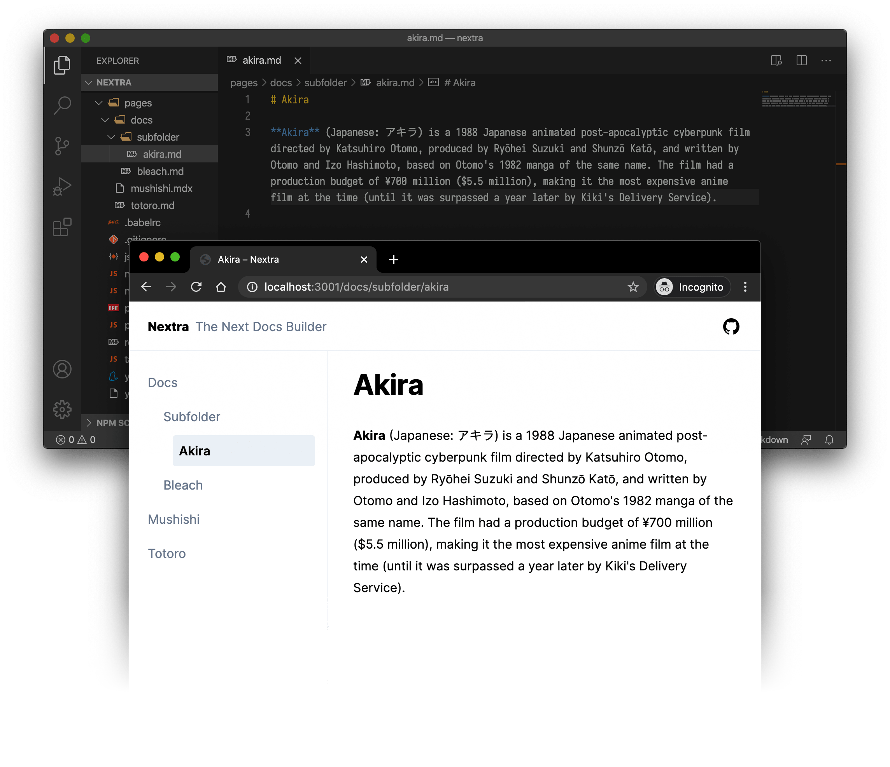

import Bleed from 'nextra-theme-docs/bleed'

# What is OpenZoo?

[OpenZoo.io](https://openzoo.io) is the main NFT Marketplace of the ZOO Ecosystem built on the Wanchain network. 

It consists of two main sections: a Decentralized NFT Explorer and an NFT Creation Platform.
Featuring many functionalities, OpenZoo is an innovative NFT Market which is easy to connect to and operate, thus offering user-friendly navigation in a seamless environment.

**Nextra** is a [Next.js](https://nextjs.org) based static site generator.

It supports Markdown and React components ([MDX](/features/mdx)), automatically generated [sidebar and anchor links](/get-started#sidebar-and-anchor-links), file-system based routing, built-in syntax highlighting, image optimization, custom layouts, i18n, and all the features you love about Next.js.

Here's what you will get in 1 minute:

<Bleed></Bleed>
